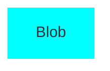

Innholdet i en fil lagres som en blob. Det er verdt å merke seg at det er *innholdet* i en fil som lagres, og ikke selve filen - navn og modus er ikke lagret i bloben.

Det betyr at dersom du har to filer som er like, (selv om de har ulike navn) vil Git bare lagre filen en gang. Det betyr også at operasjoner mot repositories (lokale og remote) vil Git kun overføre innholdet en gang, deretter blir innholdet plassert i ulike filer ved checkout.
