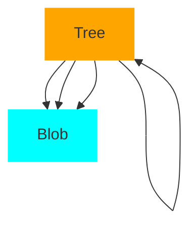

Tree i Git  representerer en katalog, og inneholder Trees og Blobs i tillegg til navn og modus for disse. Innholdet i et Tree består av en liste av modus, type, navn og SHA-1 for hvert element - som kan være enten Blob eller Tree.
