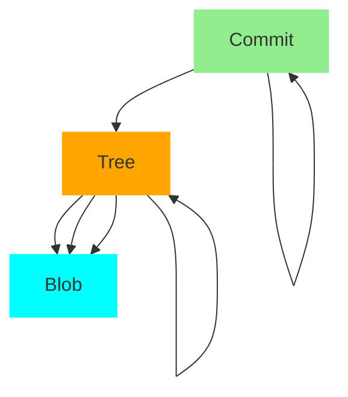

```mermaid
graph TB
classDef blob fill:cyan,stroke-width:0px;
classDef tree fill:orange,stroke-width:0px;
classDef commit fill:lightgreen,stroke-width:0px;
classDef tag fill:yellow,stroke-width:0px;
classDef peker fill:lightgrey,stroke:black, stroke-width:2px,stroke-dasharray:5,5

Blob:::blob
Tree:::tree
Tree-->Blob
Tree --> Blob
Tree --> Blob
Tree --> Tree
Commit:::commit
Commit --> Tree
Commit --> Commit
```
## Commit
 Commit inneholder en peker til et Tree, i tillegg til informasjon om
* Author
* Committer
* Message
* Parent, dersom det var en commit direkte forut for denne.
