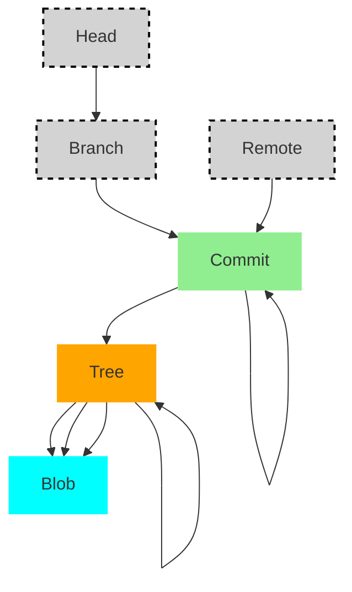

## Referanser
En branch i Git er ikke et objekt, men en referanse, og realiseres kun en ved en enkel fil som lagres i katalogen .git/refs/heads/. Denne filen inneholder SHA-1-hashen til den siste commiten for den branchen. Det betyr at alt som skal til for å lage en ny branch, er å opprette en slik fil.  For hver commit, vil innholdet i denne filene endres til å hele tiden peke på siste commit.

Disse objektene er strukturert som en rettet asyklisk graf - fra enhver commit kan man traverse i en entydig retning. Et commit-objekt peker til alltid til et Tree og til en tidligere commit, dersom den finnes. Et tre peker på en eller flere Blobs eller Trees. Denne enkle modellen muliggjør å lagre og hente frem komplekse trær raskt. Sammensatt blir datamodellen for Git noe slikt som dette: Firkantede bokser er referanser, avrundende bokser er objekter.
