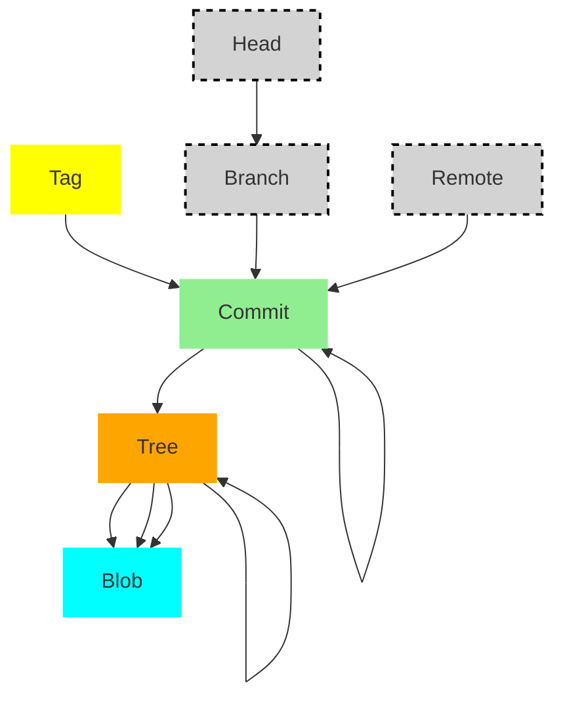

```mermaid
graph TB
classDef blob fill:cyan,stroke-width:0px;
classDef tree fill:orange,stroke-width:0px;
classDef commit fill:lightgreen,stroke-width:0px;
classDef tag fill:yellow,stroke-width:0px;
classDef peker fill:lightgrey,stroke:black, stroke-width:2px,stroke-dasharray:5,5

Blob:::blob
Tree:::tree
Tree-->Blob
Tree --> Blob
Tree --> Blob
Tree --> Tree
Commit:::commit
Commit --> Tree
Commit --> Commit
Tag:::tag
Tag --> Commit
Branch:::peker-->Commit
Remote:::peker-->Commit
Head:::peker-->Branch

```
